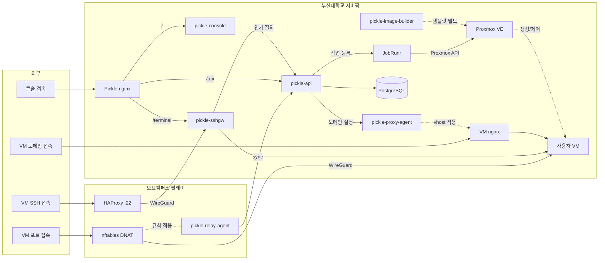

# pickle-proxy-agent

부산대학교 클라우드 플랫폼(Pickle)의 리버스 프록시 제어 에이전트입니다.

사용자가 콘솔에서 도메인을 공개하면 [pickle-api](https://github.com/PNUops/pickle-api)가
해당 FQDN의 설정 전체를 이 에이전트에 보내고, 에이전트가 nginx를 그 설정대로 맞춥니다.
표준 라이브러리만 사용하는 단일 정적 Go 바이너리입니다.

라우팅 정보의 원본은 API 서버의 데이터베이스이고, nginx 설정은 거기서 파생된 산출물입니다.
에이전트는 자기가 소유한 vhost 파일(FQDN당 한 개)만 다루고 nginx 트리의 다른 부분은
건드리지 않습니다.

## 전체 구조

```
[제어]   pickle-api ──도메인 설정(HTTP)──▶ proxy-agent ──vhost 렌더·검증──▶ nginx
[데이터] 방문자 ──HTTPS──▶ nginx ──▶ 사용자 VM의 웹 서비스
```

에이전트는 제어 경로에만 있습니다. 방문자 트래픽은 에이전트를 지나지 않으므로,
에이전트가 멈춰도 이미 공개된 도메인은 계속 서빙됩니다.

## 주요 기능

플랫폼은 VM 신청·승인·생성, SSH와 웹 터미널 접속, 도메인 공개, 만료와
삭제까지를 다룹니다. 이 저장소가 맡는 부분은 아래와 같습니다.

- **도메인 공개 적용**: 사용자가 콘솔에서 공개한 도메인이 실제로 VM의 웹 서비스에 닿도록
  프록시를 맞춥니다.
- **인증서 준비**: 플랫폼 서브도메인은 준비된 인증서를 쓰고, 사용자가 연결한 도메인은
  도메인별 인증서를 발급하고 갱신합니다.
- **공개 해제 정리**: 공개를 내리면 라우팅과 설정을 함께 거둡니다.
- **실패 격리**: 검증을 통과하지 못한 설정은 반영되지 않고, 이미 반영된 설정이 그대로
  유지됩니다.
- **대상 제한**: 프록시가 가리킬 수 있는 곳은 사용자 VM 네트워크 안으로 한정됩니다.
- **적용 상태 보고**: FQDN마다 어느 세대까지 반영됐는지와 인증서 상태를 조회할 수 있게
  내놓습니다.
- **전체 재동기화**: 스냅샷을 통째로 받아 다시 렌더하고, 목록에 없는 설정은 거둡니다.

## 동작 방식

모든 변경은 단일 직렬 큐를 지나 한 번에 하나씩 처리됩니다.

```
요청 수신 → vhost 렌더 → nginx -t 검증 → 원자적 파일 교체 → reload → 결과 보고
                              │ 어느 단계든 실패하면
                              ▼
                     직전 파일 상태로 롤백 (이미 반영된 설정은 그대로)
```

FQDN마다 단조 증가하는 `generation`을 영속화하므로, 이미 적용된 세대 이하의 요청은
no-op(`409`)입니다. 네트워크 재시도가 몇 번을 오든 결과가 같습니다.

세대와 인증서 상태는 임시 파일에 쓴 뒤 원자 교체로 영속화합니다. 적용 도중 프로세스가
죽어도 상태 파일이 반쯤 쓰인 채 남지 않습니다.

인증서는 두 갈래입니다. 플랫폼 서브도메인은 자기 루트 도메인의 와일드카드 인증서를
쓰고(`certRef`가 `wildcard:<루트>` 형태로 루트를 지목합니다 — 설정에 없는 루트는
다른 루트의 인증서로 렌더하는 대신 적용을 거부합니다. 이름을 담지 않은 인증서는
`nginx -t`를 통과한 뒤 브라우저에서만 실패하기 때문입니다), 사용자
커스텀 도메인은 도메인별 Let's Encrypt 인증서를 certbot(HTTP-01, webroot)으로
발급합니다. 발급 전에는 챌린지 전용 vhost를 먼저 올려 두고 인증서가 준비되면 정식 HTTPS
vhost로 바꾸는 2단계 렌더를 사용합니다. 발급이 실패해도 적용 자체는 실패하지 않고
`/status`에 드러납니다.

## API 표면

내부 브리지 주소(`172.30.1.10:9443`)에만 바인드합니다. 이 주소로 향하는 DNAT이 없으므로
외부에서는 도달할 수 없습니다.

- `POST /apply` — 단일 FQDN의 설정 전체를 받아 vhost를 렌더하거나 지웁니다
- `POST /sync-all` — 전체 스냅샷으로 세트를 재렌더하고, 매니페스트에 없는 vhost는 정리합니다
- `GET /status` — 헬스, FQDN별 적용 세대, 커스텀 도메인 인증서 상태

## 보안 경계

공유 bearer 토큰과 소스 IP 허용 목록을 둘 다 통과해야 합니다. 토큰이 비어 있으면 부팅을
거부합니다. 자리표시자 토큰도 부팅 단계에서 걸러냅니다. 렌더 입력도 검증해 프록시 대상은
사용자 VM 네트워크 내부 주소만 허용합니다.

## 시작하기

```bash
scripts/verify.sh        # shellcheck → gofmt → go vet → build → test → 공개 위생 검사
```

Go 1.26이 필요합니다. `gofmt -l`이 하드 게이트라 코드는 항상 gofmt 정렬 상태입니다.

## 레이아웃

```
cmd/proxy-agent/      진입점 (env 설정 → 조립 → 서비스)
internal/config/      env 기반 설정            // 토큰이 비면 여기서 부팅을 막습니다
internal/model/       pickle-api와 공유하는 wire 타입
internal/render/      vhost 템플릿 렌더와 입력 검증
internal/nginx/       nginx -t / reload 러너   // 인터페이스 + exec 구현
internal/certbot/     HTTP-01 발급             // 인터페이스 + exec 구현
internal/state/       세대·인증서 상태 JSON 영속화
internal/manager/     직렬화된 apply/sync-all  // 롤백이 있는 자리
internal/server/      HTTP 서버, 인증, 요청 빈도 제한
internal/fake/        nginx·certbot 테스트 더블 // 데몬 빌드에는 들어가지 않습니다
scripts/              verify, systemd 유닛, nginx 베이스 설정
```

## 구성 (`/etc/pickle-proxy-agent/agent.env`)

| 변수 | 의미 | 기본값 |
|---|---|---|
| `PICKLE_PROXY_AGENT_TOKEN` | 공유 bearer. 빈 값과 자리표시자는 부팅 거부 | 없음 (필수) |
| `PICKLE_PROXY_AGENT_LISTEN` | 바인드 주소 | `172.30.1.10:9443` |
| `PICKLE_PROXY_AGENT_ALLOWED_SRC` | 허용 소스 IP 목록. 빈 집합이면 전원 거부 | `172.30.1.20` |
| `PICKLE_PROXY_AGENT_WILDCARD_CERTS` | 플랫폼 루트 도메인별 와일드카드 인증서. `<루트>=<인증서>:<키>`를 쉼표로 나열합니다. 형식이 잘못되면 부팅을 거부합니다 | 없음 |
| `PICKLE_PROXY_AGENT_LE_CERT_REF` | 커스텀 도메인을 뜻하는 `certRef` 값. 호출하는 쪽이 쓰는 값과 **정확히 같아야** 합니다 — 한쪽만 바꾸면 커스텀 도메인 적용이 전부 422가 됩니다 | `letsencrypt` |

<details>
<summary>전체 변수 표와 대상 호스트 사전 조건</summary>

| 변수 | 의미 | 기본값 |
|---|---|---|
| `PICKLE_PROXY_AGENT_NGINX_DIR` | 에이전트 소유 include 디렉터리 | `/etc/nginx/pickle.d` |
| `PICKLE_PROXY_AGENT_STATE_FILE` | 세대·인증서 상태 JSON | `/var/lib/pickle-proxy-agent/state.json` |
| `PICKLE_PROXY_AGENT_NGINX_BIN` | nginx 바이너리 | `nginx` |
| `PICKLE_PROXY_AGENT_HTTPS_LISTEN` | 종단 vhost의 내부 HTTPS 리슨. `stream{}`이 :443을 소유합니다 | `127.0.0.1:8443` |
| `PICKLE_PROXY_AGENT_CERTBOT_BIN` | certbot 바이너리 | `certbot` |
| `PICKLE_PROXY_AGENT_WEBROOT` | HTTP-01 챌린지 webroot | `/var/www/certbot` |
| `PICKLE_PROXY_AGENT_LE_DIR` | Let's Encrypt live 디렉터리 | `/etc/letsencrypt/live` |
| `PICKLE_PROXY_AGENT_CERTBOT_EMAIL` | certbot 등록 이메일 | 빈 값 |

대상 호스트에 미리 갖춰져 있어야 하는 것들입니다.

- nginx 베이스 설정: `include /etc/nginx/pickle.d/*.conf`가 유효하고, `http{}`
  컨텍스트에 `$pickle_client_ip` 변수가 정의돼 있어야 합니다(정의 예시는
  `scripts/nginx/pickle-base.conf` 주석에 있습니다).
- certbot, `worker_shutdown_timeout` 설정, `PICKLE_PROXY_AGENT_WILDCARD_CERTS`에 등재한 루트별 와일드카드 인증서 파일.
- certbot 갱신 타이머의 deploy-hook: 갱신 성공 후 `systemctl reload nginx`를 실행합니다.

환경 파일이 없으면 배포 도구가 대상 호스트에서 토큰을 새로 만들어 쓰므로, 최초
설치라면 그 토큰 값을 API 쪽 환경으로 복사해야 합니다.

</details>

## 전체 아키텍처

<!-- arch:begin — 저장소 공통 블록입니다. 손으로 고치지 마세요. -->


| 저장소 | 역할 |
|---|---|
| [pickle-api](https://github.com/PNUops/pickle-api) | REST API와 프로비저닝 워커 (Spring Boot 4, Java 25, PostgreSQL 18, JobRunr) |
| [pickle-console](https://github.com/PNUops/pickle-console) | 사용자·관리자 웹 콘솔 (React 19, TypeScript) |
| [pickle-sshgw](https://github.com/PNUops/pickle-sshgw) | SSH 게이트웨이와 웹 터미널 브리지 (sshpiperd, Go) |
| [pickle-proxy-agent](https://github.com/PNUops/pickle-proxy-agent) | nginx 리버스 프록시 제어 에이전트 (Go) |
| [pickle-relay-agent](https://github.com/PNUops/pickle-relay-agent) | 오프캠퍼스 릴레이의 nftables DNAT 에이전트 (Go) |
| [pickle-image-builder](https://github.com/PNUops/pickle-image-builder) | 사용자 VM OS 이미지 빌드 레시피 (shell, virt-customize) |
| [pickle-infra](https://github.com/PNUops/pickle-infra) (비공개) | 인프라 프로비저닝 스크립트와 운영 런북 (shell) |
| [pickle-infra-example](https://github.com/PNUops/pickle-infra-example) | 프로비저닝·배포 스크립트와 런북 샘플 |
| [pickle-secrets](https://github.com/PNUops/pickle-secrets) (비공개) | 호스트 시크릿 볼트 (git-crypt) |
| [pickle-secrets-example](https://github.com/PNUops/pickle-secrets-example) | 볼트 레이아웃과 git-crypt 운용 절차 |
<!-- arch:end -->
